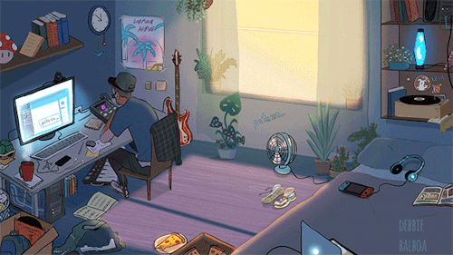

	

	<h1>Всем привет, меня зовут Асиф &#128515;</h1>

	
Я начинающий фронтенд-разработчик.
	
	
Изучаю веб-разработку с фокусом на практику. Развиваю навыки в React, TypeScript и современном JavaScript.  
	   Хочу быть частью команды, приносить пользу и расти в деле.
	

### :technologist:  Обо мне 
- :house: Я живу в г. Баку (Азербайджан :azerbaijan:);
- :technologist: Применяю стек (:orange_book: JS, :blue_book: React и TS) технологий в самостоятельных проектах с упором на чистый код, адаптивность и читаемость;
- :england: Английский язык: **B1 (продолжаю совершенствовать)** :speaking_head:.

### :toolbox:  Технологии:

&nbsp;
&nbsp;
&nbsp;
&nbsp;
&nbsp;
&nbsp;
&nbsp;
&nbsp;
&nbsp;
&nbsp;
&nbsp;
&nbsp;
&nbsp;

---

 

### :card_index_dividers:  Мои проекты  

🔹 **Todo List** — приложение для управления задачами  
Функции: добавление, удаление, фильтрация задач  
🔗 [GitHub](https://github.com/Asif-jun/todo-list)  

🔹 **Mini-game Draw** — простая рисовалка с canvas  
🔗 [GitHub](https://github.com/Asif-jun/Mini-game-Draw-)  

🔹 **Image Slider** — слайдер изображений  
🔗 [GitHub](https://github.com/Asif-jun/Creating-an-image-slider)  

🔹 **Educational Portfolio** — адаптивное портфолио на TypeScript  
🔗 [GitHub](https://github.com/Asif-jun/educational-portfolio)  

🔹 **Cards HTML** — набор адаптивных карточек  
🔗 [GitHub](https://github.com/Asif-jun/Cards)  

---

 

### :mailbox: Мои контакты  

- :mailbox_with_mail: [aassifabbasov@gmail.com](mailto:aassifabbasov@gmail.com)  
- :iphone: +7-999-644-09-18  
- :octocat: [GitHub](https://github.com/Asif-jun)  
- :link: [LinkedIn](https://www.linkedin.com/in/asif-abbasov-86a838296/)  
- :link: [Telegram](https://t.me/Zass_Massa)  

 

### :chart_with_upwards_trend:  Моя статистика

	
	
	
	
	

